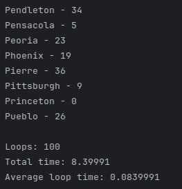

# Big-O claims and measured results

---

### Dijkstra's algorithm and travelling salesman problem

#### Big-O

n - number of cities
m - number of routes

    TIME: O(m log n)
    SPACE: O(n + m)

#### Measures

### Candy

#### Big-O

n - number of children

    TIME: O(n)
    SPACE: O(1)

[//]: # (#### Measures)

[//]: # (![Candy time]&#40;../assets/candy_time.png;)

### Find Celebrity

#### Big-O

n - number of children

    TIME: O(n)
    SPACE: O(1)

[//]: # (#### Measures)

[//]: # (![Candy time]&#40;../assets/candy_time.png;)

