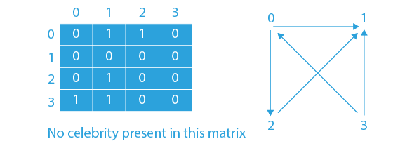
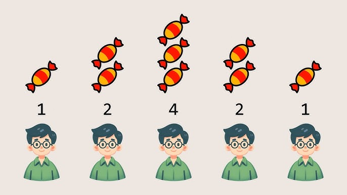

# Design & Algorithm Explanation

## Greedy Algorithms

A greedy algorithm chooses the best immediate option at each step, aiming for a global optimum. They work well when problems satisfy the greedy-choice property and optimal substructure, but they can fail otherwise.

## Celebrity Problem

We represent relationships with a matrix `knows(a, b)`. The algorithm picks an initial candidate and iteratively eliminates anyone who cannot be a celebrity. After one pass, a candidate remains, which is then verified by checking that everyone knows them and that they know no one.

Matrix Example:
[ false, true,true ]
[ false, false, true ]
[ false, false, false ]

Candidate selection picks 2 after elimination. Verification confirms the celebrity.
Lets visualise this with another example
This approach is O(n) time and O(1) extra space.

## Candy Distribution Problem

Each child initially receives one candy. We iterate left-to-right to ensure each child has more than their left neighbor if rating is higher. Then we iterate right-to-left to satisfy the right neighbor constraints. By adjusting counts during these two passes, we guarantee the minimum total candies required.

Example:

Ratings: [1,2,4,2,1]
Left-to-right pass: [1,2,4,1,1]
Right-to-left pass: [1,2,4,2,1]
Total candies = 9

This problem is O(n) in time and O(n) in space if storing candy counts separately.

Both problems showcase how greedy solutions can solve practical tasks with simple logic and minimal computation.
