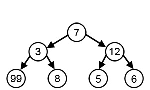

# Greedy algorithms

---

## What is a greedy algorithm?

"A greedy algorithm is an optimization technique that solves problems step by step, always selecting the best possible
choice at each moment. It follows a straightforward strategy: at every stage, it picks the option that looks most
favorable right now without considering the long-term impact of that decision."

A greedy algorithm is an algorithm that does not attempt to produce the best solution possible. Instead, it tries to
solve the problem as optimally as possible at each step, until it end up stuck at a local or absolute maximum.

## Realistic use cases

## Realistic use cases

The main goal of a greedy algorithm is to **optimize solutions** through iterative decisions.
Some typical use cases:

1) Dijkstra’s algorithm
    - Finding the shortest path in a weighted graph.
2) Knapsack problem
    - Selecting items with given weights and values to maximize value within a weight limit
3) Huffman coding
    - Creates an optimal prefix code for a set of symbols based on their frequencies.
    - Data compression.

## Advantages of Greedy Algorithms

- Simple and easy to understand: Greedy algorithms are often straightforward to implement and reason about.
- Efficient for certain problems: They can provide optimal solutions for specific problems, like finding the shortest
  path in a graph with non-negative edge weights.
- Fast execution time: Greedy algorithms generally have lower time complexity compared to other algorithms for certain
  problems.
- Intuitive and easy to explain : The decision-making process in a greedy algorithm is often easy to understand and
  justify.
- Can be used as building blocks for more complex algorithms: Greedy algorithms can be combined with other techniques to
  design more sophisticated algorithms for challenging problems.

## Disadvantages of the Greedy Approach

- Not always optimal: Greedy algorithms prioritize local optima over global optima, leading to suboptimal solutions in
  some cases.
- Difficult to prove optimality: Proving the optimality of a greedy algorithm can be challenging, requiring careful
  analysis.
- Sensitive to input order: The order of input data can affect the solution generated by a greedy algorithm.
- Limited applicability: Greedy algorithms are not suitable for all problems and may not be applicable to problems with
  complex constraints. 